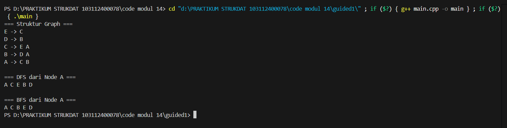
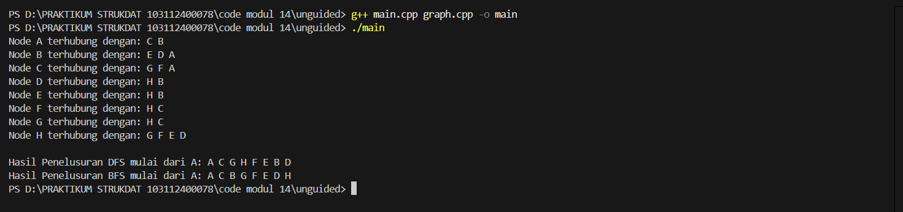

# <h1 align="center">Laporan Praktikum Modul 14 <br>GRAPH</h1>
<p align="center">MOHAMMAD REYHAN ARETHA FATIN - 103112400078</p>

## Dasar Teori
Graph adalah himpunan tidak kosong yang terdiri atas simpul-simpul (node atau vertex) dan garis-garis penghubung (edge) yang menghubungkan antar simpul. Graph digunakan untuk merepresentasikan hubungan antar objek, seperti jaringan jalan, koneksi komputer, atau hubungan antar kota. Berdasarkan arah garis penghubungnya, graph dibedakan menjadi graph berarah (directed graph) dan graph tidak berarah (undirected graph). Pada graph berarah, setiap edge memiliki arah tertentu dari satu node ke node lain, sedangkan pada graph tidak berarah, hubungan antar node bersifat dua arah tanpa penunjuk arah khusus.

Dalam representasi data, graph dapat disimpan menggunakan matriks ketetanggaan (adjacency matrix) atau multi linked list. Matriks ketetanggaan menggunakan array dua dimensi untuk menyatakan keterhubungan antar node, sedangkan multi linked list lebih efisien secara memori karena sifatnya yang dinamis dan fleksibel untuk menambah atau menghapus node dan edge.

Selain itu, terdapat beberapa algoritma penting yang digunakan untuk menelusuri graph, di antaranya Breadth First Search (BFS) dan Depth First Search (DFS). BFS melakukan penelusuran secara meluas dari simpul awal ke seluruh simpul yang berada pada tingkat yang sama sebelum berpindah ke tingkat berikutnya. Sebaliknya, DFS menelusuri graph secara mendalam dengan menjelajahi satu cabang hingga ke ujung sebelum kembali ke simpul sebelumnya untuk menjelajahi cabang lain.

Dalam beberapa kasus, graph juga digunakan untuk menentukan urutan atau prioritas pekerjaan melalui metode Topological Sort, yang digunakan pada graph berarah tanpa siklus (Directed Acyclic Graph). Proses ini menyusun elemen-elemen dalam urutan linear berdasarkan hubungan ketergantungan antar node.

Secara keseluruhan, struktur data graph memiliki peran penting dalam berbagai aplikasi seperti jaringan komputer, sistem transportasi, perencanaan proyek, dan pencarian jalur terpendek. Pada praktikum ini, implementasi graph menggunakan pendekatan multi linked list, yang memungkinkan pengelolaan data secara dinamis dan efisien dalam berbagai operasi seperti penambahan simpul, penghubungan antar simpul, serta penelusuran dengan BFS dan DFS.

## Guided

### Guided 1
#### graf.h
```c++
#ifndef GRAF_H_INCLUDED
#define GRAF_H_INCLUDED

#include <iostream>
using namespace std;

typedef char infoGraph;

struct ElmNode;
struct ElmEdge;

typedef ElmNode *adrNode;
typedef ElmEdge *adrEdge;

struct ElmNode
{
    infoGraph info;
    int visited;
    adrEdge firstEdge;
    adrNode next;
};

struct ElmEdge
{
    adrNode node;
    adrEdge next;
};

struct Graph
{
    adrNode first;
};

// PRIMITIF GRAPH
void CreateGraph(Graph &G);
adrNode AllocateNode(infoGraph X);
adrEdge AllocateEdge(adrNode N);

void InsertNode(Graph &G, infoGraph X);
adrNode FindNode(Graph G, infoGraph X);

void ConnectNode(Graph &G, infoGraph A, infoGraph B);

void PrintInfoGraph(Graph G);

// Traversal
void ResetVisited(Graph &G);
void PrintDFS(Graph &G, adrNode N);
void PrintBFS(Graph &G, adrNode N);

#endif
```
#### graf.cpp
```c++
#include "graf.h"
#include <queue>
#include <stack>

void CreateGraph(Graph &G)
{
    G.first = NULL;
}

adrNode AllocateNode(infoGraph X)
{
    adrNode P = new ElmNode;
    P->info = X;
    P->visited = 0;
    P->firstEdge = NULL;
    P->next = NULL;
    return P;
}

adrEdge AllocateEdge(adrNode N)
{
    adrEdge P = new ElmEdge;
    P->node = N;
    P->next = NULL;
    return P;
}

void InsertNode(Graph &G, infoGraph X)
{
    adrNode P = AllocateNode(X);
    P->next = G.first;
    G.first = P;
}

adrNode FindNode(Graph G, infoGraph X)
{
    adrNode P = G.first;
    while (P != NULL)
    {
        if (P->info == X)
            return P;
        P = P->next;
    }
    return NULL;
}

void ConnectNode(Graph &G, infoGraph A, infoGraph B)
{
    adrNode N1 = FindNode(G, A);
    adrNode N2 = FindNode(G, B);

    if (N1 == NULL || N2 == NULL)
    {
        cout << "Node tidak ditemukan!\n";
        return;
    }

    // Buat edge dari N1 ke N2
    adrEdge E1 = AllocateEdge(N2);
    E1->next = N1->firstEdge;
    N1->firstEdge = E1;

    // Karena undirected → buat edge balik
    adrEdge E2 = AllocateEdge(N1);
    E2->next = N2->firstEdge;
    N2->firstEdge = E2;
}

void PrintInfoGraph(Graph G)
{
    adrNode P = G.first;
    while (P != NULL)
    {
        cout << P->info << " -> ";
        adrEdge E = P->firstEdge;
        while (E != NULL)
        {
            cout << E->node->info << " ";
            E = E->next;
        }
        cout << endl;
        P = P->next;
    }
}

void ResetVisited(Graph &G)
{
    adrNode P = G.first;
    while (P != NULL)
    {
        P->visited = 0;
        P = P->next;
    }
}

void PrintDFS(Graph &G, adrNode N)
{
    if (N == NULL)
        return;

    N->visited = 1;
    cout << N->info << " ";

    adrEdge E = N->firstEdge;
    while (E != NULL)
    {
        if (E->node->visited == 0)
        {
            PrintDFS(G, E->node);
        }
        E = E->next;
    }
}

void PrintBFS(Graph &G, adrNode N)
{
    if (N == NULL)
        return;

    queue<adrNode> Q;
    Q.push(N);

    while (!Q.empty())
    {
        adrNode curr = Q.front();
        Q.pop();

        if (curr->visited == 0)
        {
            curr->visited = 1;
            cout << curr->info << " ";

            adrEdge E = curr->firstEdge;
            while (E != NULL)
            {
                if (E->node->visited == 0)
                {
                    Q.push(E->node);
                }
                E = E->next;
            }
        }
    }
}

```
#### main.cpp
```c++
#include "graf.h"
#include "graf.cpp"
#include <iostream>
using namespace std;

int main()
{
    Graph G;
    CreateGraph(G);

    // Tambah node
    InsertNode(G, 'A');
    InsertNode(G, 'B');
    InsertNode(G, 'C');
    InsertNode(G, 'D');
    InsertNode(G, 'E');

    // Hubungkan node (graph tidak berarah)
    ConnectNode(G, 'A', 'B');
    ConnectNode(G, 'A', 'C');
    ConnectNode(G, 'B', 'D');
    ConnectNode(G, 'C', 'E');

    cout << "=== Struktur Graph ===\n";
    PrintInfoGraph(G);

    cout << "\n=== DFS dari Node A ===\n";
    ResetVisited(G);
    PrintDFS(G, FindNode(G, 'A'));

    cout << "\n\n=== BFS dari Node A ===\n";
    ResetVisited(G);
    PrintBFS(G, FindNode(G, 'A'));

    cout << endl;
    return 0;
}

```

> Output
> 
> 
Program ini mengimplementasikan struktur data Graph tidak berarah menggunakan representasi Adjacency List, di mana setiap simpul (Node) menyimpan daftar tetangga melalui rantai elemen sisi (Edge). Kode ini menyediakan fungsi utama untuk membangun graf, seperti InsertNode untuk menambah titik dan ConnectNode yang secara otomatis menciptakan hubungan timbal balik antar dua simpul. Selain itu, program menyertakan dua algoritma penelusuran (traversal), yaitu Depth-First Search (DFS) yang menggunakan rekursi untuk menjelajah sedalam mungkin, serta Breadth-First Search (BFS) yang memanfaatkan antrian (queue) untuk menjelajah simpul tetangga level demi level. Berdasarkan hasil eksekusi pada main.cpp, graf yang dibentuk dengan simpul A hingga E berhasil ditampilkan strukturnya dan ditelusuri urutannya mulai dari simpul 'A' sesuai dengan prinsip kedua algoritma tersebut.

## UNGUIDED 1
1.Buatlah implementasi ADT Graph pada file “graph.cpp” dan cobalah hasil implementasi ADT
pada file “main.cpp”.

2. Buatlah prosedur untuk menampilkanhasil penelusuran DFS.
   
3. Buatlah prosedur untuk menampilkanhasil penelusuran BFS.
   prosedur PrintBFS (Graph G, adrNode N);

#### graph.h
```c++
#ifndef GRAPH_H_INCLUDED
#define GRAPH_H_INCLUDED

#include <iostream>
using namespace std;

typedef char infoGraph;
typedef struct ElmNode *adrNode;
typedef struct ElmEdge *adrEdge;

struct ElmNode {
    infoGraph info;
    int visited;
    adrEdge firstEdge;
    adrNode Next;
};

struct ElmEdge {
    adrNode Node;
    adrEdge Next;
};

struct Graph {
    adrNode First;
};

void CreateGraph(Graph &G);
adrNode AlokasiNode(infoGraph X);
adrEdge AlokasiEdge(adrNode N);
void InsertNode(Graph &G, infoGraph X);
void ConnectNode(adrNode N1, adrNode N2);
void PrintInfoGraph(Graph G);
void PrintDFS(Graph G, adrNode N);
void PrintBFS(Graph G, adrNode N);

#endif
```
#### graph.cpp
```c++
#include "graph.h"
#include <iostream>

using namespace std;

struct QNode {
    adrNode dataGraphNode;
    QNode* next;
};

struct Queue {
    QNode *Head;
    QNode *Tail;
};

void createQueue(Queue &Q) {
    Q.Head = NULL;
    Q.Tail = NULL;
}

bool isQueueEmpty(Queue Q) {
    return (Q.Head == NULL);
}

void enqueue(Queue &Q, adrNode N) {
    QNode* newNode = new QNode;
    newNode->dataGraphNode = N;
    newNode->next = NULL;

    if (isQueueEmpty(Q)) {
        Q.Head = newNode;
        Q.Tail = newNode;
    } else {
        Q.Tail->next = newNode;
        Q.Tail = newNode;
    }
}

adrNode dequeue(Queue &Q) {
    if (isQueueEmpty(Q)) {
        return NULL;
    } else {
        QNode* temp = Q.Head;
        adrNode val = temp->dataGraphNode;
        
        Q.Head = Q.Head->next;
        if (Q.Head == NULL) {
            Q.Tail = NULL;
        }
        
        delete temp;
        return val;
    }
}

void CreateGraph(Graph &G) {
    G.First = NULL;
}

adrNode AlokasiNode(infoGraph X) {
    adrNode P = new ElmNode;
    P->info = X;
    P->visited = 0;
    P->firstEdge = NULL;
    P->Next = NULL;
    return P;
}

adrEdge AlokasiEdge(adrNode N) {
    adrEdge E = new ElmEdge;
    E->Node = N;
    E->Next = NULL;
    return E;
}

void InsertNode(Graph &G, infoGraph X) {
    adrNode P = AlokasiNode(X);
    if (G.First == NULL) {
        G.First = P;
    } else {
        adrNode Last = G.First;
        while (Last->Next != NULL) {
            Last = Last->Next;
        }
        Last->Next = P;
    }
}

void ConnectNode(adrNode N1, adrNode N2) {
    adrEdge E1 = AlokasiEdge(N2);
    E1->Next = N1->firstEdge;
    N1->firstEdge = E1;

    adrEdge E2 = AlokasiEdge(N1);
    E2->Next = N2->firstEdge;
    N2->firstEdge = E2;
}

void PrintInfoGraph(Graph G) {
    adrNode P = G.First;
    while (P != NULL) {
        cout << "Node " << P->info << " terhubung dengan: ";
        adrEdge E = P->firstEdge;
        while (E != NULL) {
            cout << E->Node->info << " ";
            E = E->Next;
        }
        cout << endl;
        P = P->Next;
    }
}

void ResetVisited(Graph &G) {
    adrNode P = G.First;
    while (P != NULL) {
        P->visited = 0;
        P = P->Next;
    }
}

void DFS_Helper(adrNode N) {
    if (N == NULL) return;
    
    N->visited = 1;     
    cout << N->info << " "; 

    adrEdge E = N->firstEdge;
    while (E != NULL) {
        if (E->Node->visited == 0) {
            DFS_Helper(E->Node);
        }
        E = E->Next;
    }
}

void PrintDFS(Graph G, adrNode N) {
    ResetVisited(G);
    cout << "Hasil Penelusuran DFS mulai dari " << N->info << ": ";
    DFS_Helper(N);
    cout << endl;
}

void PrintBFS(Graph G, adrNode N) {
    ResetVisited(G);
    cout << "Hasil Penelusuran BFS mulai dari " << N->info << ": ";

    if (N == NULL) return;

    Queue Q;
    createQueue(Q);
    
    N->visited = 1;
    enqueue(Q, N);

    while (!isQueueEmpty(Q)) {
        adrNode current = dequeue(Q);
        
        cout << current->info << " ";

        adrEdge E = current->firstEdge;
        while (E != NULL) {
            if (E->Node->visited == 0) {
                E->Node->visited = 1;
                enqueue(Q, E->Node);
            }
            E = E->Next;
        }
    }
    cout << endl;
}
```
#### main.cpp
```c++
#include "graph.h"
#include <iostream>

using namespace std;

adrNode FindNode(Graph G, char X) {
    adrNode P = G.First;
    while (P != NULL) {
        if (P->info == X) {
            return P;
        }
        P = P->Next;
    }
    return NULL;
}

int main() {
    Graph G;
    CreateGraph(G);

    InsertNode(G, 'A');
    InsertNode(G, 'B');
    InsertNode(G, 'C');
    InsertNode(G, 'D');
    InsertNode(G, 'E');
    InsertNode(G, 'F');
    InsertNode(G, 'G');
    InsertNode(G, 'H');

    adrNode A = FindNode(G, 'A');
    adrNode B = FindNode(G, 'B');
    adrNode C = FindNode(G, 'C');
    adrNode D = FindNode(G, 'D');
    adrNode E = FindNode(G, 'E');
    adrNode F = FindNode(G, 'F');
    adrNode G_node = FindNode(G, 'G');
    adrNode H = FindNode(G, 'H');

    ConnectNode(A, B);
    ConnectNode(A, C);
    
    ConnectNode(B, D);
    ConnectNode(B, E);
    
    ConnectNode(C, F);
    ConnectNode(C, G_node);
    
    ConnectNode(D, H);
    ConnectNode(E, H);
    ConnectNode(F, H);
    ConnectNode(G_node, H);

    PrintInfoGraph(G);
    cout << endl;

    PrintDFS(G, A); 
    PrintBFS(G, A);

    return 0;
}
```
> Output soal 1
> 
> 

Program ini mengimplementasikan struktur data Graph tidak berarah menggunakan representasi Adjacency List, di mana setiap simpul (Node) memiliki pointer yang menunjuk ke daftar sisi (Edge) tetangganya. Berbeda dengan contoh sebelumnya, kode ini mendefinisikan struktur Queue secara manual (tanpa menggunakan library STL) untuk mendukung operasional algoritma Breadth-First Search (BFS). Fungsi inti seperti InsertNode digunakan untuk menginisialisasi simpul dari 'A' hingga 'H', sedangkan ConnectNode membangun hubungan dua arah antar simpul tersebut. Program juga menyediakan algoritma Depth-First Search (DFS) yang dijalankan melalui fungsi rekursif DFS_Helper. Berdasarkan hasil eksekusi pada unguided1.png, program berhasil menampilkan daftar keterhubungan antar Node serta urutan penelusuran yang dimulai dari simpul 'A', menghasilkan output spesifik "A C G H F E B D" untuk DFS dan "A C B G F E D H" untuk BFS.


## Referensi

1. https://www.programiz.com/dsa/graph-dfs (diakses pada 14 Desember 2025)
2. https://www.geeksforgeeks.org/dsa/graph-data-structure-and-algorithms/ (diakses pada 14 Desember 2025)
3. Modul Praktikum: Modul 14 Struktur Data - Graph (diakses pada 14 Desember 2025)
