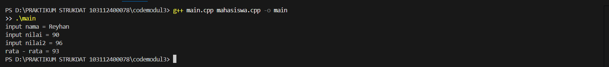
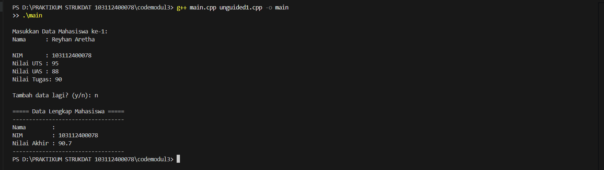
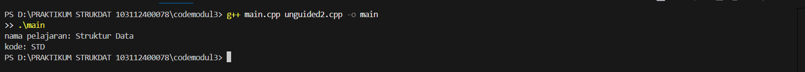

# <h1 align="center">Laporan Praktikum Modul 3 <br> ABSTRACT DATA TYPE</h1>
<p align="center">MOHAMMAD REYHAN ARETHA FATIN - 103112400078</p>

## Dasar Teori
Abstract Data Type (ADT) adalah sebuah model matematis yang mendefinisikan sebuah tipe data beserta sekumpulan operasi dasar (primitif) terhadap tipe tersebut, tanpa mengungkap bagaimana tipe data tersebut diimplementasikan. Konsep ini memungkinkan pemisahan antara spesifikasi (apa yang dilakukan oleh tipe data) dan implementasi (bagaimana hal itu dilakukan), yang merupakan prinsip dasar dalam rekayasa perangkat lunak. ADT bersifat statik, artinya definisinya ditentukan pada saat kompilasi dan tidak berubah selama eksekusi program. Sebuah ADT bahkan dapat tersusun dari ADT lainnya, misalnya ADT Waktu yang terdiri dari ADT Jam dan ADT Tanggal

Operasi-operasi dasar atau primitif pada ADT dikelompokkan ke dalam beberapa kategori. Konstruktor atau kreator berfungsi untuk menciptakan atau membentuk nilai dari tipe ADT tersebut. Selektor digunakan untuk mengakses komponen-komponen dari tipe data. Selain itu, terdapat juga operator relasional untuk perbandingan (seperti lebih besar dari, sama dengan) , operator aritmatika untuk operasi hitung , prosedur I/O untuk interaksi dengan perangkat masukan/keluaran , serta destruktor untuk melepaskan memori yang digunakan oleh objek ADT.

Dalam implementasinya menggunakan bahasa C++, konsep ADT biasanya diwujudkan dengan memisahkan kode ke dalam dua jenis file utama. File pertama adalah header file dengan ekstensi .h, yang berisi definisi atau spesifikasi tipe data (umumnya menggunakan struct atau class) beserta deklarasi header dari fungsi-fungsi primitifnya. File kedua adalah source file dengan ekstensi .cpp, yang berisi kode program atau realisasi dari setiap fungsi primitif yang telah dideklarasikan di file header. File utama program (misalnya, main.cpp) kemudian dapat menggunakan ADT tersebut dengan menyertakan file header-nya (#include "namafile.h").

## Guided

### mahasiswa.h
```c++
#ifndef MAHASISWA_H_INCLUDED
#define MAHASISWA_H_INCLUDED
struct mahasiswa
{
    char nim[10];
    int nilai1, nilai2;
};
void inputMhs(mahasiswa &m);
float rata2(mahasiswa m);
#endif
```
Program ini adalah sebuah file header yang fungsinya adalah untuk mendeklarasikan komponen-komponen yang akan digunakan bersama oleh file-file .cpp lainnya. Di dalamnya, Anda mendefinisikan sebuah tipe data struct baru bernama mahasiswa yang mengelompokkan tiga variabel: nim, nilai1, dan nilai2. Selain itu, file ini juga berisi prototipe fungsi untuk inputMhs dan rata2. Prototipe ini memberitahu kompiler tentang nama fungsi, tipe data yang dikembalikan (return type), dan parameter yang dibutuhkannya, tanpa menjelaskan isi atau logika dari fungsi tersebut. Tujuannya adalah agar file lain yang menyertakan (#include) header ini tahu cara menggunakan struct mahasiswa dan fungsi-fungsi tersebut.

### mahasiswa.cpp
```c++
#ifndef MAHASISWA_H_INCLUDED
#define MAHASISWA_H_INCLUDED
struct mahasiswa
{
    char nim[10];
    int nilai1, nilai2;
};
void inputMhs(mahasiswa &m);
float rata2(mahasiswa m);
#endif
```
Program ni adalah file sumber (source file) yang berisi definisi atau implementasi kode dari fungsi-fungsi yang sebelumnya hanya dideklarasikan di mahasiswa.h. Di sinilah logika sebenarnya ditulis. Kode untuk fungsi inputMhs ditulis secara lengkap, yaitu bagaimana cara menampilkan teks ke layar menggunakan cout dan menerima masukan dari pengguna menggunakan cin. Begitu pula dengan fungsi rata2, di mana kode untuk proses aritmetika penjumlahan dan pembagian untuk menghitung nilai rata-rata ditulis secara rinci. File ini secara efektif menyediakan kode yang akan dieksekusi saat fungsi-fungsi tersebut dipanggil.

### main.cpp
```c++
#include <iostream>
#include "mahasiswa.h"
using namespace std;

int main()
{
    mahasiswa mhs;
    inputMhs(mhs);
    cout << "rata - rata = " << rata2(mhs);
    return 0;
} 
```
> Output
> 
> 

ini berisi fungsi main, yang merupakan titik masuk (entry point) dari keseluruhan program. Eksekusi kode selalu dimulai dari sini. Program ini menginstansiasi atau menciptakan sebuah variabel bernama mhs dari tipe struct mahasiswa. Selanjutnya, ia mengatur alur program dengan memanggil fungsi inputMhs untuk mengisi data ke dalam variabel mhs, kemudian memanggil fungsi rata2 untuk memproses data tersebut, dan terakhir menggunakan cout untuk menampilkan hasil akhir ke konsol. File ini bertugas menggunakan semua komponen yang telah dideklarasikan dan didefinisikan di file lain untuk menjalankan alur program yang spesifik dan mencapai tujuan akhir.

## Unguided

### Soal 1

Buatlah sebuah program untuk melakukan transpose pada sebuah matriks persegi berukuran 3x3. Operasi transpose adalah mengubah baris menjadi kolom dan sebaliknya. Inisialisasi matriks awal di dalam kode, kemudian buat logika untuk melakukan transpose dan simpan hasilnya ke dalam matriks baru. Terakhir, tampilkan matriks awal dan matriks hasil transpose.

```c++
#include <iostream>
using namespace std;

int main()
{
    int matrix[3][3] = {
        {1, 2, 3},
        {4, 5, 6},
        {7, 8, 9}
    };
    
    cout << "Matriks Awal:" << endl;
    for (int i = 0; i < 3; ++i) {
        for (int j = 0; j < 3; ++j) {
            cout << matrix[i][j] << " ";
        }
        cout << endl;
    }

    cout << "Matriks Transpose:" << endl;
    for (int i = 0; i < 3; ++i) {
        for (int j = 0; j < 3; ++j) {
            cout << matrix[j][i] << " ";
        }
        cout << endl; 
    }
    
    return 0;
}
```

> Output
> 
> 

Kode ini juga bertujuan menukar nilai dua variabel, tetapi menggunakan metode call by reference yang lebih modern di C++. Fungsi tukar menerima parameter sebagai referensi (int &x, int &y), yang membuatnya menjadi alias atau nama lain untuk variabel a dan b yang dilewatkan. Dengan demikian, setiap perubahan pada x dan y di dalam fungsi secara otomatis akan mengubah nilai asli dari a dan b di fungsi main tanpa perlu menggunakan sintaks pointer.

### Soal 2

Buatlah program yang menunjukkan penggunaan call by reference. Buat sebuah prosedur bernama kuadratkan yang menerima satu parameter integer secara referensi (&). Prosedur ini akan mengubah nilai asli variabel yang dilewatkan dengan nilai kuadratnya. Tampilkan nilai variabel di main() sebelum dan sesudah memanggil prosedur untuk membuktikan perubahannya.

```c++
#include <iostream>

void kuadratkan(int& angka) {
    angka = angka * angka;
}

int main() {
    int bilangan = 5;
    std::cout << "Nilai awal: " << bilangan << std::endl;
    kuadratkan(bilangan);
    std::cout << "Nilai setelah dikuadratkan: " << bilangan << std::endl;
    return 0;
}
```

> Output
> 
> 

Program ini merupakan duplikat fungsional dari guided1 yang juga mendemonstrasikan call by reference. Sebuah fungsi bernama kuadratkan didefinisikan untuk menerima referensi ke sebuah variabel integer angka. Ketika fungsi kuadratkan dipanggil dari main dengan variabel bilangan, fungsi tersebut memodifikasi nilai bilangan secara langsung dengan menghitung kuadratnya, dan perubahan ini bersifat permanen setelah fungsi selesai dieksekusi.

## Referensi

1. Pointers in C++ - GeeksforGeeks: https://www.geeksforgeeks.org/pointers-in-c/ (diakses pada 3 Oktober 2025)
2. Passing arguments by value, reference, and address - learncpp.com: https://www.learncpp.com/cpp-tutorial/passing-arguments-by-reference/ (diakses pada 3 Oktober 2025)
3. Pointers - CPlusPlus.com: http://www.cplusplus.com/doc/tutorial/pointers/ (diakses pada 3 Oktober 2025)
