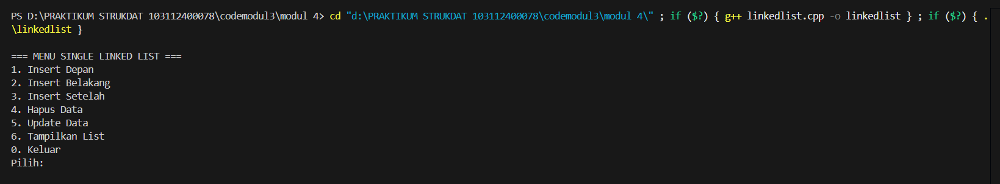
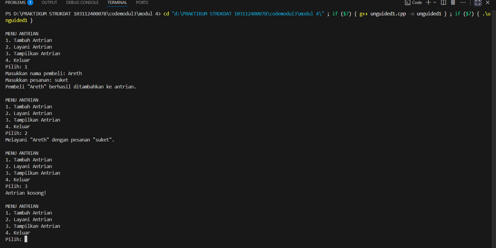
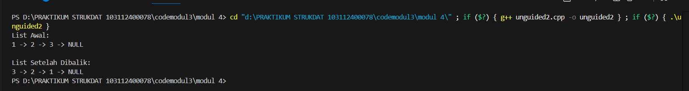

# <h1 align="center">Laporan Praktikum Modul 4 <br> SINGLY LINKED LIST (BAGIAN PERTAMA)</h1>
<p align="center">MOHAMMAD REYHAN ARETHA FATIN - 103112400078</p>

## Dasar Teori
Linked list (senarai berantai) adalah salah satu struktur data fundamental yang terdiri dari serangkaian elemen data—disebut sebagai node—yang saling terhubung. Berbeda dengan array yang bersifat statis, linked list bersifat dinamis dan fleksibel, artinya ukurannya dapat bertambah atau berkurang sesuai kebutuhan selama program berjalan. Implementasi linked list lebih efektif menggunakan pointer karena sifatnya yang dinamis dan kemampuannya untuk merepresentasikan hubungan antar elemen dengan lebih mudah. 

Model yang paling dasar adalah Singly Linked List, di mana setiap elemen hanya memiliki satu arah pointer. Setiap elemen atau node dalam Singly Linked List terdiri dari dua komponen utama: data (informasi yang disimpan) dan sebuah pointer yang disebut suksesor atau next, yang berfungsi sebagai penghubung ke elemen berikutnya dalam urutan. Pointer pertama dalam list disebut first atau head, yang menunjuk ke alamat elemen pertama. Elemen terakhir dalam list akan memiliki pointer next yang menunjuk ke NULL, menandakan akhir dari list. Karakteristik ini membuat Singly Linked List hanya dapat ditelusuri ke satu arah (maju).

Operasi-operasi dasar pada linked list meliputi pembuatan list (CreateList), yaitu menginisialisasi list kosong, dan manajemen memori yang mencakup alokasi (memesan memori untuk node baru, menggunakan new di C++) dan dealokasi (melepaskan memori, menggunakan delete di C++). Operasi utama lainnya adalah penyisipan elemen (Insert), yang dapat dilakukan di awal list (Insert First), di akhir list (Insert Last), atau setelah elemen tertentu (Insert After). Selain itu, terdapat operasi penghapusan elemen (Delete) dari awal, akhir, atau setelah elemen tertentu , serta penelusuran (View) untuk menampilkan seluruh isi list.

## Guided

### Guided 1
```c++
#include <iostream>
using namespace std;

// Struktur Node
struct Node {
    int data;
    Node* next;
};

// Pointer awal dan akhir
Node* head = nullptr;

// Fungsi untuk membuat node baru
Node* createNode(int data) {
    Node* newNode = new Node();
    newNode->data = data;
    newNode->next = nullptr;
    return newNode;
}

void insertDepan(int data) {
    Node* newNode = createNode(data);
    newNode->next = head;
    head = newNode;
    cout << "Data " << data << " berhasil ditambahkan di depan.\n";
}

void insertBelakang(int data) {
    Node* newNode = createNode(data);
    if (head == nullptr) {
        head = newNode;
    } else {
        Node* temp = head;
        while (temp->next != nullptr) {
            temp = temp->next;
        }
        temp->next = newNode;
    }
    cout << "Data " << data << " berhasil ditambahkan di belakang.\n";
}

void insertSetelah(int target, int dataBaru) {
    Node* temp = head;
    while (temp != nullptr && temp->data != target) {
        temp = temp->next;
    }

    if (temp == nullptr) {
        cout << "Data " << target << " tidak ditemukan!\n";
    } else {
        Node* newNode = createNode(dataBaru);
        newNode->next = temp->next;
        temp->next = newNode;
        cout << "Data " << dataBaru << " berhasil disisipkan setelah " << target << ".\n";
    }
}

// ========== DELETE FUNCTION ==========
void hapusNode(int data) {
    if (head == nullptr) {
        cout << "List kosong!\n";
        return;
    }

    Node* temp = head;
    Node* prev = nullptr;

    // Jika data di node pertama
    if (temp != nullptr && temp->data == data) {
        head = temp->next;
        delete temp;
        cout << "Data " << data << " berhasil dihapus.\n";
        return;
    }

    // Cari node yang akan dihapus
    while (temp != nullptr && temp->data != data) {
        prev = temp;
        temp = temp->next;
    }

    // Jika data tidak ditemukan
    if (temp == nullptr) {
        cout << "Data " << data << " tidak ditemukan!\n";
        return;
    }

    prev->next = temp->next;
    delete temp;
    cout << "Data " << data << " berhasil dihapus.\n";
}

// ========== UPDATE FUNCTION ==========
void updateNode(int dataLama, int dataBaru) {
    Node* temp = head;
    while (temp != nullptr && temp->data != dataLama) {
        temp = temp->next;
    }

    if (temp == nullptr) {
        cout << "Data " << dataLama << " tidak ditemukan!\n";
    } else {
        temp->data = dataBaru;
        cout << "Data " << dataLama << " berhasil diupdate menjadi " << dataBaru << ".\n";
    }
}

// ========== DISPLAY FUNCTION ==========
void tampilkanList() {
    if (head == nullptr) {
        cout << "List kosong!\n";
        return;
    }

    Node* temp = head;
    cout << "Isi Linked List: ";
    while (temp != nullptr) {
        cout << temp->data << " -> ";
        temp = temp->next;
    }
    cout << "NULL\n";
}

// ========== MAIN PROGRAM ==========
int main() {
    int pilihan, data, target, dataBaru;

    do {
        cout << "\n=== MENU SINGLE LINKED LIST ===\n";
        cout << "1. Insert Depan\n";
        cout << "2. Insert Belakang\n";
        cout << "3. Insert Setelah\n";
        cout << "4. Hapus Data\n";
        cout << "5. Update Data\n";
        cout << "6. Tampilkan List\n";
        cout << "0. Keluar\n";
        cout << "Pilih: ";
        cin >> pilihan;

        switch (pilihan) {
            case 1:
                cout << "Masukkan data: ";
                cin >> data;
                insertDepan(data);
                break;
            case 2:
                cout << "Masukkan data: ";
                cin >> data;
                insertBelakang(data);
                break;
            case 3:
                cout << "Masukkan data target: ";
                cin >> target;
                cout << "Masukkan data baru: ";
                cin >> dataBaru;
                insertSetelah(target, dataBaru);
                break;
            case 4:
                cout << "Masukkan data yang ingin dihapus: ";
                cin >> data;
                hapusNode(data);
                break;
            case 5:
                cout << "Masukkan data lama: ";
                cin >> data;
                cout << "Masukkan data baru: ";
                cin >> dataBaru;
                updateNode(data, dataBaru);
                break;
            case 6:
                tampilkanList();
                break;
            case 0:
                cout << "Program selesai.\n";
                break;
            default:
                cout << "Pilihan tidak valid!\n";
        }
    } while (pilihan != 0);

    return 0;
}
```
> Output
> 
> 

Program C++ ini pada dasarnya adalah sebuah implementasi dari struktur data singly linked list, yang bisa kita bayangkan seperti rangkaian gerbong kereta. Setiap elemen (Node) merupakan sebuah "gerbong" yang menyimpan data numerik dan sebuah penunjuk (pointer) ke gerbong berikutnya dalam urutan. Melalui menu interaktif yang disediakan, Anda dapat dengan mudah mengelola rangkaian data ini dengan melakukan berbagai operasi fundamental seperti menambahkan data baru di awal, di akhir, atau di posisi tertentu; menghapus data yang tidak lagi diperlukan; memperbarui nilai data yang sudah ada; dan menampilkan seluruh isi rangkaian data dari gerbong pertama (head) hingga yang terakhir.

## Unguided

### Soal 1

 buatlah single linked list untuk Antrian yang menyimpan data pembeli( nama dan pesanan). program memiliki beberapa menu seperti tambah antrian,  layani antrian(hapus), dan tampilkan antrian. \*antrian pertama harus yang pertama dilayani
   
```c++
#include <iostream>
#include <string>

using namespace std;

struct Pembeli {
    string nama;
    string pesanan;
};

struct Node {
    Pembeli data;
    Node* next;
};

class Queue {
private:
    Node* head;
    Node* tail;

public:
    Queue() {
        head = nullptr;
        tail = nullptr;
    }

    ~Queue() {
        while (head != nullptr) {
            Node* temp = head;
            head = head->next;
            delete temp;
        }
    }

    void tambahAntrian(Pembeli data) {
        Node* newNode = new Node{data, nullptr};
        if (tail == nullptr) {
            head = tail = newNode;
        } else {
            tail->next = newNode;
            tail = newNode;
        }
        cout << "Pembeli \"" << data.nama << "\" berhasil ditambahkan ke antrian.\n";
    }

    void layaniAntrian() {
        if (head == nullptr) {
            cout << "Antrian kosong.\n";
            return;
        }
        
        Node* temp = head;
        cout << "Melayani \"" << temp->data.nama << "\" dengan pesanan \"" << temp->data.pesanan << "\".\n";
        
        head = head->next;
        if (head == nullptr) {
            tail = nullptr;
        }
        delete temp;
    }

    void tampilkanAntrian() {
        if (head == nullptr) {
            cout << "Antrian kosong!\n";
            return;
        }

        cout << "Isi antrian saat ini:\n";
        Node* temp = head;
        int nomor = 1;
        while (temp != nullptr) {
            cout << nomor << ". Nama: " << temp->data.nama << ", Pesanan: " << temp->data.pesanan << "\n";
            temp = temp->next;
            nomor++;
        }
    }
};

int main() {
    Queue antrian;
    int pilihan;
    Pembeli dataPembeli;

    while (true) {
        cout << "\nMENU ANTRIAN\n";
        cout << "1. Tambah Antrian\n";
        cout << "2. Layani Antrian\n";
        cout << "3. Tampilkan Antrian\n";
        cout << "4. Keluar\n";
        cout << "Pilih: ";
        cin >> pilihan;

        if (pilihan == 4) {
            break;
        }

        switch (pilihan) {
            case 1:
                cout << "Masukkan nama pembeli: ";
                cin.ignore();
                getline(cin, dataPembeli.nama);
                cout << "Masukkan pesanan: ";
                getline(cin, dataPembeli.pesanan);
                antrian.tambahAntrian(dataPembeli);
                break;
            case 2:
                antrian.layaniAntrian();
                break;
            case 3:
                antrian.tampilkanAntrian();
                break;
            default:
                cout << "Pilihan tidak valid.\n";
        }
    }

    return 0;
}
```

> Output
> 
> 

Program C++ ini merupakan simulasi dari sistem antrian (Queue) yang bekerja berdasarkan prinsip First-In, First-Out (FIFO), persis seperti antrian di dunia nyata dimana orang yang pertama datang akan dilayani lebih dulu. Dengan menggunakan struktur data linked list, program ini mengelola daftar Pembeli, masing-masing dengan nama dan pesanannya. Terdapat penanda head untuk orang di barisan paling depan dan tail untuk yang paling belakang. Melalui menu interaktif, Anda dapat menambahkan pembeli baru ke akhir antrian (tail), melayani pembeli yang berada di depan antrian (head) yang kemudian akan keluar dari barisan, serta menampilkan seluruh daftar orang yang sedang mengantri secara berurutan.
### Soal 2

buatlah program kode untuk membalik (reverse) singly linked list (1-2-3 menjadi 3-2-1) 

```c++
#include <iostream>

using namespace std;

struct Node {
    int data;
    Node* next;
};

void insert(Node** head_ref, int new_data) {
    Node* new_node = new Node();
    new_node->data = new_data;
    new_node->next = (*head_ref);
    (*head_ref) = new_node;
}

void display(Node* node) {
    while (node != nullptr) {
        cout << node->data << " -> ";
        node = node->next;
    }
    cout << "NULL" << endl;
}

void reverse(Node** head_ref) {
    Node* prev = nullptr;
    Node* current = *head_ref;
    Node* next = nullptr;

    while (current != nullptr) {
        next = current->next;
        current->next = prev;
        prev = current;
        current = next;
    }
    *head_ref = prev;
}

int main() {
    Node* head = nullptr;

    insert(&head, 3);
    insert(&head, 2);
    insert(&head, 1);

    cout << "List Awal: " << endl;
    display(head);

    reverse(&head);

    cout << "\nList Setelah Dibalik: " << endl;
    display(head);

    return 0;
}
```

> Output
> 
> 

Tentu, ini penjelasannya dalam satu paragraf.

Program C++ ini menunjukkan cara canggih untuk membalik urutan sebuah *singly linked list* dengan menggunakan pendekatan **rekursif**. Pada dasarnya, program ini pertama-tama membuat sebuah list sederhana dengan urutan `1 -> 2 -> 3`. Kemudian, fungsi `reverse` dipanggil, yang secara rekursif akan "menyelam" hingga ke node paling akhir. Dari titik akhir tersebut, ia mulai bekerja mundur ke atas, membalikkan arah setiap sambungan (`pointer`) satu per satu, sehingga node yang tadinya menunjuk ke node berikutnya kini berbalik menunjuk ke node sebelumnya. Proses ini secara efektif mengubah node terakhir menjadi `head` (kepala) yang baru dan membalik seluruh urutan list, menghasilkan output akhir `3 -> 2 -> 1`.

## Referensi

1. GeeksforGeeks - Linked List Data Structure: https://www.geeksforgeeks.org/data-structures/linked-list/ (diakses pada 9 Oktober 2025)
2. Programiz - Linked List Data Structure: https://www.programiz.com/dsa/linked-list (diakses pada 9 Oktober 2025)
3. Carnegie Mellon University - Singly Linked Lists: https://www.cs.cmu.edu/~adamchik/15-121/lectures/Linked%20Lists/linked%20lists.html (diakses pada 9 Oktober 2025)
