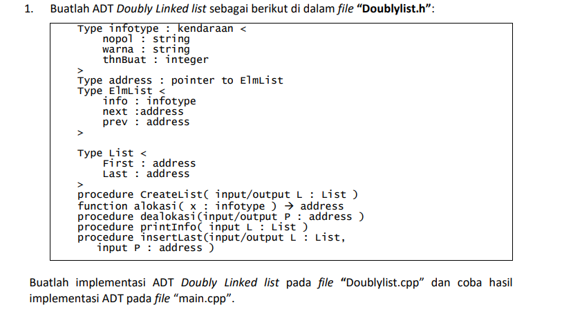
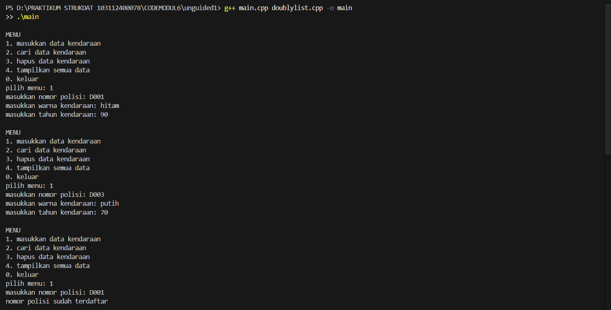
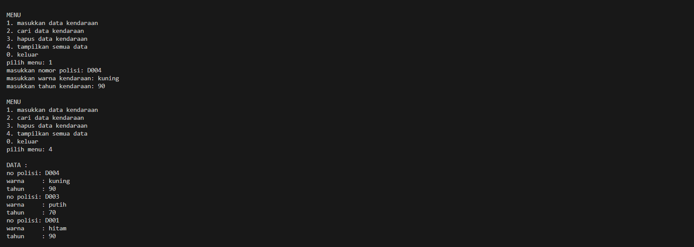

# <h1 align="center">Laporan Praktikum Modul 6 <br> DOUBLY LINKED LIST (BAGIAN PERTAMA)</h1>
<p align="center">MOHAMMAD REYHAN ARETHA FATIN - 103112400078</p>

## Dasar Teori
Doubly Linked List (DLL) adalah sebuah struktur data linked list di mana setiap elemennya memiliki dua penunjuk: satu penunjuk ke elemen sesudahnya (next) dan satu penunjuk ke elemen sebelumnya (prev). Fitur ini membedakannya dari Singly Linked List dan memungkinkan penelusuran data dilakukan secara dua arah, baik maju maupun mundur. Sebuah DLL biasanya dikelola menggunakan dua penunjuk utama: First, yang menunjuk ke elemen pertama list , dan Last, yang menunjuk ke elemen terakhir list. Sebuah list dianggap kosong jika penunjuk first (dan last) bernilai NULL atau Nil.

Dalam implementasi C++, struktur data ini umumnya didefinisikan menggunakan dua struct. Pertama, struct elmlist (atau node) yang berisi tiga komponen utama: info untuk menyimpan data , address next sebagai pointer ke elemen berikutnya , dan address prev sebagai pointer ke elemen sebelumnya. Kedua, struct list yang merepresentasikan list itu sendiri, berisi dua pointer yaitu address first dan address last.

Operasi dasar pada Doubly Linked List meliputi penyisipan (insert) dan penghapusan (delete) elemen. Untuk Insert First, elemen baru (P) ditambahkan di awal list dengan mengatur P->next agar menunjuk ke L.first saat ini, kemudian (L.first)->prev diatur agar menunjuk ke P, dan terakhir L.first diperbarui untuk menunjuk ke P. Serupa dengan itu, Insert Last menambahkan elemen baru (P) di akhir list. Ini dilakukan dengan mengatur P->prev agar menunjuk ke L.last saat ini, lalu (L.last)->next diatur menunjuk ke P, dan akhirnya L.last diperbarui menjadi P. Untuk Insert After, elemen baru (P) disisipkan setelah elemen tertentu (R) dengan cara menghubungkan P di antara R dan elemen setelah R (R->next). Langkahnya adalah mengatur P->next menunjuk ke R->next , P->prev menunjuk ke R , kemudian (R->next)->prev diatur menunjuk ke P , dan R->next diatur menunjuk ke P (mengikuti logika diagram, meskipun teks  memiliki typo Rprev).

Operasi penghapusan juga memiliki beberapa variasi. Delete First menghapus elemen pertama (P) dari list. Ini dimulai dengan menyimpan alamat L.first ke dalam P. Kemudian, L.first diperbarui agar menunjuk ke elemen kedua (L.first = P->next atau L.first = (L.first)->next). Penunjuk prev dari L.first yang baru kemudian diatur ke Nil. Terakhir, P diputuskan dari list (misalnya P->next = Nil ) dan memorinya di-dealokasi. Untuk Delete Last, elemen terakhir (P) dihapus dengan menyimpan alamat L.last ke P. L.last kemudian diperbarui agar menunjuk ke elemen sebelumnya (L.last = P->prev atau L.last = (L.last)->prev). Penunjuk next dari L.last yang baru diatur ke Nil. P lalu diputuskan dari list (P->prev = Nil ) dan di-dealokasi. Terakhir, Delete After menghapus elemen (P) yang berada setelah elemen tertentu (R). Ini dilakukan dengan "melompati" P: R->next diatur agar menunjuk ke elemen setelah P (P->next) , dan (P->next)->prev diatur agar menunjuk kembali ke R. Setelah itu, P diputuskan hubungannya dari list (P->prev = Nil;, P->next = Nil;) dan di-dealokasi.

## Guided

### Guided 1
```c++
#include <iostream>
using namespace std;

struct Node {
    int data;
    Node* prev;
    Node* next;
};

Node* head = nullptr;
Node* tail = nullptr;

void insertDepan(int data) {
    Node* newNode = new Node();
    newNode->data = data;
    newNode->prev = nullptr;
    newNode->next = head;

    if (head != nullptr)
        head->prev = newNode;
    else
        tail = newNode;

    head = newNode;
    cout << "Data " << data << " berhasil ditambahkan di depan.\n";
}

void insertBelakang(int data) {
    Node* newNode = new Node();
    newNode->data = data;
    newNode->next = nullptr;
    newNode->prev = tail;

    if (tail != nullptr)
        tail->next = newNode;
    else
        head = newNode;

    tail = newNode;
    cout << "Data " << data << " berhasil ditambahkan di belakang.\n";
}

void insertSetelah(int target, int data) {
    Node* current = head;
    while (current != nullptr && current->data != target)
        current = current->next;
    
    if (current == nullptr) {
        cout << "Data " << target << " tidak ditemukan.\n";
        return;
    }

    Node* newNode = new Node();
    newNode->data = data;
    newNode->next = current->next;
    newNode->prev = current;

    if (current->next != nullptr)
        current->next->prev = newNode;
    else
        tail = newNode;

    current->next = newNode;
    cout << "Data " << data << " berhasil disisipkan setelah " << target << ".\n";
}

void hapusDepan() {
    if (head == nullptr) {
        cout << "List kosong.\n";
        return;
    }

    Node* temp = head;
    head = head->next;

    if (head != nullptr)
        head->prev = nullptr;
    else
        tail = nullptr;

    cout << "Data " << temp->data << " dihapus dari depan.\n";
    delete temp;
}

void hapusBelakang() {
    if (tail = nullptr) {
        cout << "List kosong.\n";
        return;
    }

    Node* temp = tail;
    tail = tail->prev;

    if (tail != nullptr)
        tail->next = nullptr;
    else
        head = nullptr;

    cout << "Data " << temp->data << " dihapus dari belakang.\n";
    delete temp;
}

void hapusData(int target) {
    if (head == nullptr) {
        cout << "List kosong.\n";
        return;
    }

    Node* current = head;
    while (current != nullptr && current->data != target)
        current = current->next;

    if (current == head)
        hapusDepan();
    else if (current == tail)
        hapusBelakang();
    else {
        current->prev->next = current->next;
        current->next->prev = current->prev;
        cout << "Data " << target << " dihapus.\n";
        delete current;
    }
}

void updateData(int oldData, int newData) {
    Node* current = head;
    while (current != nullptr && current->data != oldData)
        current = current->next;

    if (current == nullptr) {
        cout << "Data " << oldData << " tidak ditemukan.\n";
        return;
    }

    current->data = newData;
    cout << "Data " << oldData << " diubah menjadi " << newData << ".\n";
}

void tampilDepan() {
    if (head == nullptr) {
        cout << "List kosong.\n";
        return;
    }

    cout << "Isi list (dari depan): ";
    Node* current = head;
    while (current != nullptr) {
        cout << current->data << " ";
        current = current->next;
    }
    cout << "\n";
}

// ====================================
// Fungsi: Tampilkan dari belakang
// ====================================
void tampilBelakang() {
    if (tail == nullptr) {
        cout << "List kosong.\n";
        return;
    }

    cout << "Isi list (dari belakang): ";
    Node* current = tail;
    while (current != nullptr) {
        cout << current->data << " ";
        current = current->prev;
    }
    cout << "\n";
}

// ====================================
// MAIN PROGRAM (MENU INTERAKTIF)
// ====================================
int main() {
    int pilihan, data, target, oldData, newData;

    do {
        cout << "\n===== MENU DOUBLE LINKED LIST =====\n";
        cout << "1. Insert Depan\n";
        cout << "2. Insert Belakang\n";
        cout << "3. Insert Setelah Data\n";
        cout << "4. Hapus Depan\n";
        cout << "5. Hapus Belakang\n";
        cout << "6. Hapus Data Tertentu\n";
        cout << "7. Update Data\n";
        cout << "8. Tampil dari Depan\n";
        cout << "9. Tampil dari Belakang\n";
        cout << "0. Keluar\n";
        cout << "===================================\n";
        cout << "Pilih menu: ";
        cin >> pilihan;

        switch (pilihan) {
            case 1:
                cout << "Masukkan data: ";
                cin >> data;
                insertDepan(data);
                break;
            case 2:
                cout << "Masukkan data: ";
                cin >> data;
                insertBelakang(data);
                break;
            case 3:
                cout << "Masukkan data target: ";
                cin >> target;
                cout << "Masukkan data baru: ";
                cin >> data;
                insertSetelah(target, data);
                break;
            case 4:
                hapusDepan();
                break;
            case 5:
                hapusBelakang();
                break;
            case 6:
                cout << "Masukkan data yang ingin dihapus: ";
                cin >> target;
                hapusData(target);
                break;
            case 7:
                cout << "Masukkan data lama: ";
                cin >> oldData;
                cout << "Masukkan data baru: ";
                cin >> newData;
                updateData(oldData, newData);
                break;
            case 8:
                tampilDepan();
                break;
            case 9:
                tampilBelakang();
                break;
            case 0:
                cout << "👋 Keluar dari program.\n";
                break;
            default:
                cout << "Pilihan tidak valid.\n";
        }

    } while (pilihan != 0);

    return 0;
}
```

> Output
> 
> 

Program C++ ini adalah implementasi dari struktur data doubly linked list, yang memungkinkan penyimpanan data integer di mana setiap elemen (disebut Node) terhubung ke elemen sebelum (prev) dan sesudahnya (next). Program ini menyediakan fungsionalitas penuh untuk mengelola daftar tersebut melalui menu interaktif: pengguna dapat menambahkan data baru ke awal daftar (insertDepan), ke akhir (insertBelakang), atau setelah data tertentu (insertSetelah). Selain itu, program ini juga mendukung penghapusan data dari awal (hapusDepan), dari akhir (hapusBelakang), atau menghapus data spesifik di mana pun dalam daftar (hapusData). Terdapat pula fungsi untuk memperbarui nilai data yang sudah ada (updateData) serta dua opsi untuk menampilkan keseluruhan isi daftar, baik dari urutan depan ke belakang (tampilDepan) maupun dari belakang ke depan (tampilBelakang), yang semuanya dikendalikan melalui pilihan menu di konsol hingga pengguna memilih untuk keluar.

## UNGUIDED

### Soal 1

> 

### Soal 2
Carilah elemen dengan nomor polisi D001 dengan membuat fungsi baru.
fungsi findElm( L : List, x : infotype ) : address

### Soal 3
Hapus elemen dengan nomor polisi D003 dengan procedure delete.
- procedure deleteFirst( input/output L : List,
 P : address )
- procedure deleteLast( input/output L : List,
 P : address )
- procedure deleteAfter( input Prec : address,
 input/output P : address )

### JAWABAN NOMOR 1,2,3

#### doublylist.h
```c++
#ifndef DOUBLYLIST_H
#define DOUBLYLIST_H

#include <iostream>
#include <string>

using namespace std;

#define Nil NULL

struct infotype {
    string nopol;
    string warna;
    int thnBuat;
};

typedef struct elmlist *address;
struct elmlist {
    infotype info;
    address next;
    address prev;
};

struct list {
    address First;
    address Last;
};

void CreateList(list &L);
address alokasi(infotype x);
void dealokasi(address &P);
void printInfo(list L);

void insertLast(list &L, address P);

address findElm(list L, string nopol);

void deleteFirst(list &L, address &P);
void deleteLast(list &L, address &P);
void deleteAfter(list &L, address Prec, address &P);

#endif
```
#### doublylist.cpp
```c++
#include "Doublylist.h"

void CreateList(list &L) {
    L.First = Nil;
    L.Last = Nil;
}

address alokasi(infotype x) {
    address P = new elmlist;
    P->info = x;
    P->next = Nil;
    P->prev = Nil;
    return P;
}

void dealokasi(address &P) {
    delete P;
}

address findElm(list L, string nopol) {
    address P = L.First;
    while (P != Nil) {
        if (P->info.nopol == nopol) {
            return P;
        }
        P = P->next;
    }
    return Nil;
}

void insertLast(list &L, address P) {
    if (L.First == Nil) {
        L.First = P;
        L.Last = P;
    } else {
        P->prev = L.Last;
        L.Last->next = P;
        L.Last = P;
    }
}

void printInfo(list L) {
    address P = L.Last;
    if (P == Nil) {
        cout << "List kosong." << endl;
        return;
    }
    
    while (P != Nil) {
        cout << "no polisi: " << P->info.nopol << endl;
        cout << "warna     : " << P->info.warna << endl;
        cout << "tahun     : " << P->info.thnBuat << endl;
        P = P->prev;
    }
}

void deleteFirst(list &L, address &P) {
    P = L.First;
    if (L.First == Nil) {
        return;
    }
    
    if (L.First == L.Last) {
        L.First = Nil;
        L.Last = Nil;
    } else {
        L.First = P->next;
        L.First->prev = Nil;
        P->next = Nil;
    }
}

void deleteLast(list &L, address &P) {
    P = L.Last;
    if (L.First == Nil) {
        return;
    }
    
    if (L.First == L.Last) {
        L.First = Nil;
        L.Last = Nil;
    } else {
        L.Last = P->prev;
        L.Last->next = Nil;
        P->prev = Nil;
    }
}

void deleteAfter(list &L, address Prec, address &P) {
    if (Prec == Nil || Prec->next == Nil || Prec == L.Last) {
        P = Nil;
        return;
    }
    
    if (Prec->next == L.Last) {
        deleteLast(L, P);
    } else {
        P = Prec->next;
        address Succ = P->next;
        Prec->next = Succ;
        Succ->prev = Prec;
        P->next = Nil;
        P->prev = Nil;
    }
}
```
#### main.cpp
```c++
#include "Doublylist.h"
#include <iostream>
#include <string>

using namespace std;

void hapusKendaraan(list& L, string target) {
    address currentNode = findElm(L, target);
    if (currentNode == Nil) { 
        cout << "data dengan nomor polisi " << target << " tidak ditemukan" << endl;
        return;
    }

    address temp;
    if (currentNode == L.First) {
        deleteFirst(L, temp);
    } else {
        address precNode = currentNode->prev;
        deleteAfter(L, precNode, temp);
    }
    
    cout << "data dengan nomor polisi " << target << " berhasil dihapus" << endl;
    dealokasi(temp); 
}

int main() {
    list L; 
    CreateList(L); 
    address P;
    infotype data;
    string target;
    int pilihan;

    do {
        cout << "\nMENU\n";
        cout << "1. masukkan data kendaraan\n";
        cout << "2. cari data kendaraan\n";
        cout << "3. hapus data kendaraan\n";
        cout << "4. tampilkan semua data\n";
        cout << "0. keluar\n";
        cout << "pilih menu: ";
        cin >> pilihan;
        cin.ignore(); 

        switch (pilihan) {
            case 1:
                cout << "masukkan nomor polisi: ";
                getline(cin, data.nopol);
                if (findElm(L, data.nopol) != Nil) { 
                    cout << "nomor polisi sudah terdaftar" << endl;
                } else {
                    cout << "masukkan warna kendaraan: ";
                    getline(cin, data.warna);
                    cout << "masukkan tahun kendaraan: ";
                    cin >> data.thnBuat;
                    cin.ignore(); 
                    P = alokasi(data);
                    insertLast(L, P);
                }
                break;
            case 2:
                cout << "masukkan nomor polisi yang dicari: ";
                getline(cin, target);
                P = findElm(L, target);
                if (P != Nil) { 
                    cout << "\ndata ditemukan:" << endl;
                    cout << "nomor polisi: " << P->info.nopol << endl; 
                    cout << "warna       : " << P->info.warna << endl; 
                    cout << "tahun       : " << P->info.thnBuat << endl; 
                } else {
                    cout << "data tidak ditemukan" << endl;
                }
                break;
            case 3:
                cout << "masukkan nomor polisi yang akan dihapus: ";
                getline(cin, target);
                hapusKendaraan(L, target);
                break;
            case 4:
                cout << "\nDATA :" << endl;
                printInfo(L);
                break;
            case 0:
                cout << "tengkyuu\n";
                break;
            default:
                cout << "pilihan tidak valid\n";
        }
    } while (pilihan != 0);

    return 0;
}
```
#### OUTPUT & DEKSRIPSI PROGRAM
> Output soal 1
> 
> 
> 

Program C++ ini adalah sebuah implementasi dari doubly linked list yang dirancang khusus untuk mengelola data kendaraan. Setiap kendaraan disimpan sebagai sebuah node yang berisi infotype berupa nomor polisi (string nopol), warna (string warna), dan tahun pembuatan (int thnBuat). Program utama (main.cpp) menyediakan menu interaktif yang memungkinkan pengguna untuk melakukan beberapa operasi: (1) memasukkan data kendaraan baru, yang akan ditambahkan ke akhir daftar (insertLast) setelah memvalidasi bahwa nomor polisi tersebut belum terdaftar; (2) mencari kendaraan berdasarkan nomor polisi (findElm) dan menampilkan detailnya jika ditemukan; (3) menghapus kendaraan berdasarkan nomor polisi (menggunakan fungsi hapusKendaraan yang secara cerdas memanggil deleteFirst atau deleteAfter); dan (4) menampilkan semua data kendaraan yang ada, di mana fungsi printInfo secara khusus mencetak daftar tersebut dalam urutan terbalik (dari data terakhir yang dimasukkan ke data pertama) dengan menelusuri pointer prev.

> Output soal 2
> 
> 

menunjukkan pengguna memilih menu 2, yaitu "cari data kendaraan". Program kemudian merespons dengan meminta "masukkan nomor polisi yang dicari:", dan pengguna mengetikkan D001 sebagai target pencarian. Ini memicu pemanggilan fungsi P = findElm(L, target). Fungsi findElm kemudian menelusuri list mulai dari L.First ke depan, membandingkan P->info.nopol dengan target "D001". Karena data "D001" (yang dimasukkan pada gambar unguided1.1.png) ditemukan dalam list, fungsi findElm mengembalikan address P dari node tersebut, yang berarti P tidak Nil. Akibatnya, kondisi if (P != Nil) di main.cpp terpenuhi, dan program mencetak "data ditemukan:" diikuti oleh rincian data yang tersimpan di P->info, yaitu nomor polisi D001, warna hitam, dan tahun 90.

> Output soal 3
> 
> 
> 
ini mendemonstrasikan eksekusi dari menu 3, yaitu "hapus data kendaraan". Pengguna diminta untuk memasukkan nomor polisi yang akan dihapus, dan mereka mengetikkan D004. Ini memanggil fungsi hapusKendaraan dengan target "D004". Fungsi ini pertama-tama menggunakan findElm untuk menemukan node yang berisi "D004". Berdasarkan konteks dari gambar sebelumnya, "D004" adalah data terakhir yang dimasukkan, sehingga ia adalah L.Last dalam list. Karena node ini bukan elemen pertama (L.First), fungsi hapusKendaraan mengambil node sebelumnya (precNode, yaitu "D003") dan memanggil deleteAfter(L, precNode, temp). Di dalam deleteAfter, program mendeteksi bahwa node yang akan dihapus (Prec->next) adalah L.Last, sehingga ia memanggil fungsi deleteLast(L, temp). deleteLast kemudian memperbarui L.Last untuk menunjuk ke node "D003", mengatur pointer next dari "D003" menjadi Nil, dan mengembalikan node "D004" yang telah terputus. Akhirnya, hapusKendaraan mencetak pesan sukses "data dengan nomor polisi D004 berhasil dihapus" dan memanggil dealokasi(temp) untuk membebaskan memori node tersebut.


## Referensi

1. https://www.geeksforgeeks.org/cpp/doubly-linked-list-in-cpp/ (diakses pada 23 Oktober 2025)
2. https://www.programiz.com/dsa/doubly-linked-list (diakses pada 23 Oktober 2025)
3. https://www.tutorialspoint.com/cplusplus-program-to-implement-doubly-linked-list (diakses pada 23 Oktober 2025)
