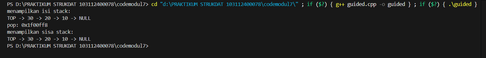
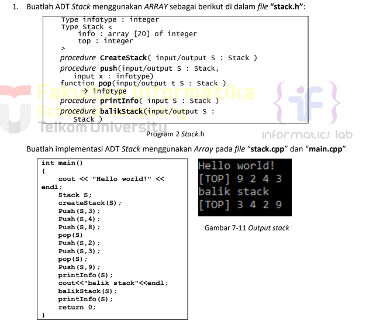
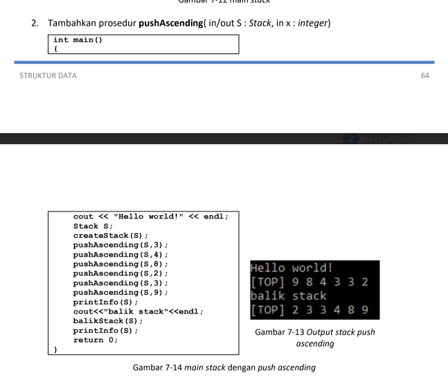
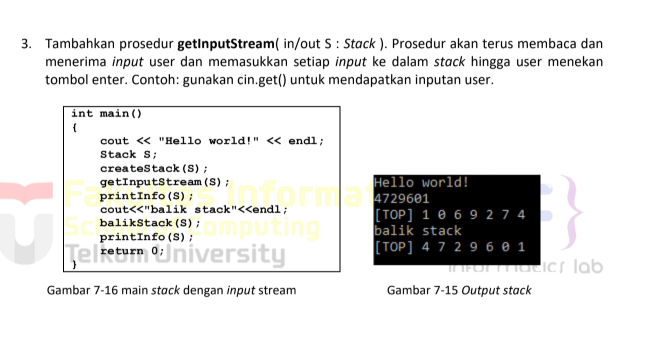
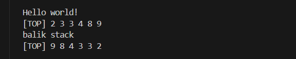

# <h1 align="center">Laporan Praktikum Modul 6 <br>STACK</h1>
<p align="center">MOHAMMAD REYHAN ARETHA FATIN - 103112400078</p>

## Dasar Teori

## Guided

### Guided 1
```c++
#include <iostream>
using namespace std;

struct Node
{
    int data;
    Node *next;
};

bool isEmpty(Node *top)
{
    return top == nullptr;
}

void push(Node *&top, int data)
{
    Node *newNode = new Node();
    newNode->data = data;
    newNode->next = top;
    top = newNode;
}

int pop(Node *&top)
{
    if (isEmpty(top))
    {
        cout << "Stack kosong, tidak bisa pop!" << endl;
        return 0;
    }

    int poppedData = top->data;
    Node *temp = top;
    top = top->next;
    
    delete temp;
    return poppedData;
}

void show(Node *top)
{
    if (isEmpty(top))
    {
        cout << "Stack kosong." << endl;
        return;
    }

    cout << "TOP -> ";
    Node *temp = top;

    while (temp != nullptr)
    {
        cout << temp->data << " -> ";
        temp = temp->next;
    }

    cout << "NULL" << endl;
}

int main()
{
    Node*stack = nullptr;

    push(stack, 10);
    push(stack, 20);
    push(stack, 30);
    
    cout << "menampilkan isi stack: " << endl;
    show(stack);

    cout << "pop: " <<(stack) <<endl;

    cout << "menampilkan sisa stack: " << endl;
    show(stack);

    return 0;
}
```

> Output
> 
> 

Program C++ ini adalah implementasi dari struktur data doubly linked list, yang memungkinkan penyimpanan data integer di mana setiap elemen (disebut Node) terhubung ke elemen sebelum (prev) dan sesudahnya (next). Program ini menyediakan fungsionalitas penuh untuk mengelola daftar tersebut melalui menu interaktif: pengguna dapat menambahkan data baru ke awal daftar (insertDepan), ke akhir (insertBelakang), atau setelah data tertentu (insertSetelah). Selain itu, program ini juga mendukung penghapusan data dari awal (hapusDepan), dari akhir (hapusBelakang), atau menghapus data spesifik di mana pun dalam daftar (hapusData). Terdapat pula fungsi untuk memperbarui nilai data yang sudah ada (updateData) serta dua opsi untuk menampilkan keseluruhan isi daftar, baik dari urutan depan ke belakang (tampilDepan) maupun dari belakang ke depan (tampilBelakang), yang semuanya dikendalikan melalui pilihan menu di konsol hingga pengguna memilih untuk keluar.

## UNGUIDED

### Soal 1

> 

### Soal 2

> 

### Soal 3

> 

### JAWABAN NOMOR 1,2,3

#### stack.h
```c++
#ifndef STACK_H
#define STACK_H

#include <iostream>
#define MAX_STACK 20 

typedef int infotype;

struct Stack {
    infotype info[MAX_STACK + 1]; 
    int top;
};
void createStack(Stack &S);
bool isEmpty(Stack S);
bool isFull(Stack S);
void push(Stack &S, infotype x);
infotype pop(Stack &S);
void printInfo(Stack S);
void balikStack(Stack &S);
void pushAscending(Stack &S, infotype x);
void getInputStream(Stack &S);

#endif
```
#### stack.cpp
```c++
#include "stack.h"
#include <iostream> 

using namespace std; 

void createStack(Stack &S) {
    S.top = 0;
}

bool isEmpty(Stack S) {
    return S.top == 0;
}
bool isFull(Stack S) {
    return S.top == MAX_STACK;
}
void push(Stack &S, infotype x) {
    if (!isFull(S)) {
        S.top++; 
        S.info[S.top] = x;
    } else {
        cout << "Stack penuh!" << endl;
    }
}
infotype pop(Stack &S) {
    if (!isEmpty(S)) {
        infotype x = S.info[S.top];
        S.top--; 
        return x;
    } else {
        cout << "Stack kosong!" << endl; 
        return -1; 
    }
}

void printInfo(Stack S) {
    cout << "[TOP] "; 
    for (int i = S.top; i >= 1; i--) {
        cout << S.info[i] << " "; 
    }
    cout << endl; 
}

void balikStack(Stack &S) {
    Stack temp1, temp2;
    createStack(temp1);
    createStack(temp2);

    while (!isEmpty(S)) {
        push(temp1, pop(S));
    }
    while (!isEmpty(temp1)) {
        push(temp2, pop(temp1));
    }
    while (!isEmpty(temp2)) {
        push(S, pop(temp2));
    }
}

void pushAscending(Stack &S, infotype x) {
    Stack temp;
    createStack(temp);
    while (!isEmpty(S) && x > S.info[S.top]) {
        push(temp, pop(S));
    }
    push(S, x);
    while (!isEmpty(temp)) {
        push(S, pop(temp));
    }
}

void getInputStream(Stack &S) {
    char c;
    c = cin.get(); 
    while (c != '\n') {
        if (c >= '0' && c <= '9') {
            push(S, c - '0');
        }
        c = cin.get(); 
    }
}
```
#### main.cpp
```c++
#include "stack.h"
#include <iostream>

using namespace std;

int main() {
    
    // Latihan 1
    cout << "Hello world!" << endl; 
    Stack S1;
    createStack(S1); 
    push(S1, 3);     
    push(S1, 4);     
    push(S1, 8);     
    pop(S1);         
    push(S1, 2);     
    push(S1, 3);     
    pop(S1);         
    push(S1, 9);     
    printInfo(S1);   
    cout << "balik stack" << endl; 
    balikStack(S1);  
    printInfo(S1);   

    cout << endl; 

    // Latihan 2
    cout << "Hello world!" << endl; 
    Stack S2;
    createStack(S2); 
    pushAscending(S2, 3); 
    pushAscending(S2, 4); 
    pushAscending(S2, 8); 
    pushAscending(S2, 2); 
    pushAscending(S2, 3); 
    pushAscending(S2, 9); 
    printInfo(S2); 
    cout << "balik stack" << endl; 
    balikStack(S2); 
    printInfo(S2); 

    cout << endl; 

    // Latihan 3
    cout << "Hello world!" << endl; 
    Stack S3;
    createStack(S3); 
    
    cin.sync(); 
    
    getInputStream(S3); 
    printInfo(S3); 
    cout << "balik stack" << endl; 
    balikStack(S3); 
    printInfo(S3); 

    return 0; 
}
```
#### OUTPUT & DEKSRIPSI PROGRAM
> Output soal 1
> 
> 

Program C++ ini adalah sebuah implementasi dari doubly linked list yang dirancang khusus untuk mengelola data kendaraan. Setiap kendaraan disimpan sebagai sebuah node yang berisi infotype berupa nomor polisi (string nopol), warna (string warna), dan tahun pembuatan (int thnBuat). Program utama (main.cpp) menyediakan menu interaktif yang memungkinkan pengguna untuk melakukan beberapa operasi: (1) memasukkan data kendaraan baru, yang akan ditambahkan ke akhir daftar (insertLast) setelah memvalidasi bahwa nomor polisi tersebut belum terdaftar; (2) mencari kendaraan berdasarkan nomor polisi (findElm) dan menampilkan detailnya jika ditemukan; (3) menghapus kendaraan berdasarkan nomor polisi (menggunakan fungsi hapusKendaraan yang secara cerdas memanggil deleteFirst atau deleteAfter); dan (4) menampilkan semua data kendaraan yang ada, di mana fungsi printInfo secara khusus mencetak daftar tersebut dalam urutan terbalik (dari data terakhir yang dimasukkan ke data pertama) dengan menelusuri pointer prev.

> Output soal 2
> 
> 

menunjukkan pengguna memilih menu 2, yaitu "cari data kendaraan". Program kemudian merespons dengan meminta "masukkan nomor polisi yang dicari:", dan pengguna mengetikkan D001 sebagai target pencarian. Ini memicu pemanggilan fungsi P = findElm(L, target). Fungsi findElm kemudian menelusuri list mulai dari L.First ke depan, membandingkan P->info.nopol dengan target "D001". Karena data "D001" (yang dimasukkan pada gambar unguided1.1.png) ditemukan dalam list, fungsi findElm mengembalikan address P dari node tersebut, yang berarti P tidak Nil. Akibatnya, kondisi if (P != Nil) di main.cpp terpenuhi, dan program mencetak "data ditemukan:" diikuti oleh rincian data yang tersimpan di P->info, yaitu nomor polisi D001, warna hitam, dan tahun 90.

> Output soal 3
> 
> 
> 
ini mendemonstrasikan eksekusi dari menu 3, yaitu "hapus data kendaraan". Pengguna diminta untuk memasukkan nomor polisi yang akan dihapus, dan mereka mengetikkan D004. Ini memanggil fungsi hapusKendaraan dengan target "D004". Fungsi ini pertama-tama menggunakan findElm untuk menemukan node yang berisi "D004". Berdasarkan konteks dari gambar sebelumnya, "D004" adalah data terakhir yang dimasukkan, sehingga ia adalah L.Last dalam list. Karena node ini bukan elemen pertama (L.First), fungsi hapusKendaraan mengambil node sebelumnya (precNode, yaitu "D003") dan memanggil deleteAfter(L, precNode, temp). Di dalam deleteAfter, program mendeteksi bahwa node yang akan dihapus (Prec->next) adalah L.Last, sehingga ia memanggil fungsi deleteLast(L, temp). deleteLast kemudian memperbarui L.Last untuk menunjuk ke node "D003", mengatur pointer next dari "D003" menjadi Nil, dan mengembalikan node "D004" yang telah terputus. Akhirnya, hapusKendaraan mencetak pesan sukses "data dengan nomor polisi D004 berhasil dihapus" dan memanggil dealokasi(temp) untuk membebaskan memori node tersebut.


## Referensi

1. https://www.geeksforgeeks.org/cpp/doubly-linked-list-in-cpp/ (diakses pada 23 Oktober 2025)
2. https://www.programiz.com/dsa/doubly-linked-list (diakses pada 23 Oktober 2025)
3. https://www.tutorialspoint.com/cplusplus-program-to-implement-doubly-linked-list (diakses pada 23 Oktober 2025)
