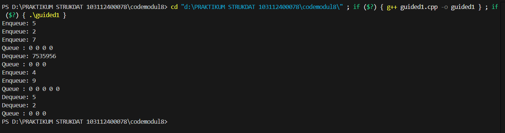
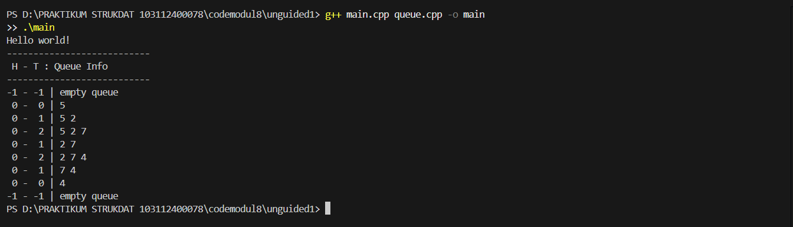
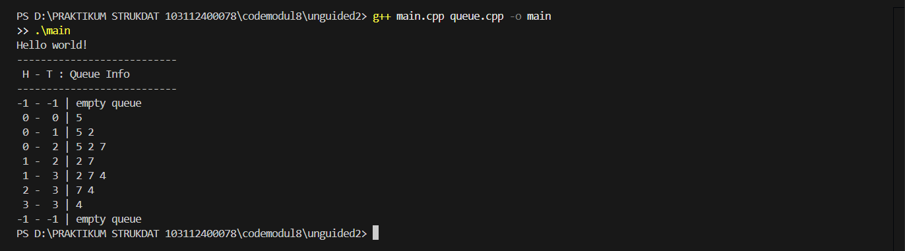
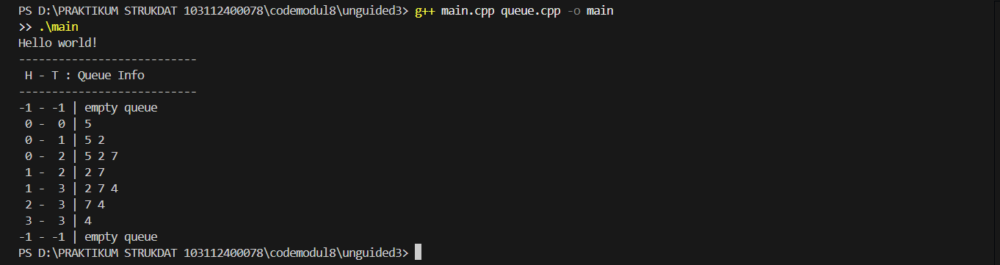

# <h1 align="center">Laporan Praktikum Modul 8 <br>QUEUE</h1>
<p align="center">MOHAMMAD REYHAN ARETHA FATIN - 103112400078</p>

## Dasar Teori
Queue (antrean) adalah struktur data yang merepresentasikan konsep antrean dalam dunia nyata, seperti antrean pada loket pembelian tiket kereta api. Prinsip dasar yang digunakan dalam Queue adalah First In First Out (FIFO), yang berarti elemen atau data yang pertama kali masuk ke dalam antrean akan menjadi yang pertama kali dilayani atau diakses, sedangkan yang terakhir masuk akan dilayani paling akhir. Dalam struktur ini, terdapat dua operasi utama, yaitu operasi penyisipan (Insert atau Enqueue) dan operasi pengambilan (Delete atau Dequeue). Sesuai prinsip FIFO, proses penyisipan elemen (Enqueue) selalu dilakukan pada bagian belakang (Tail), sedangkan proses penghapusan elemen (Dequeue) hanya dilakukan pada bagian depan (Head).

Implementasi Queue dalam bahasa C dapat dilakukan menggunakan dua pendekatan utama, yaitu menggunakan tipe data linked list dan tipe data array (tabel). Pada implementasi menggunakan linked list, operasi yang dilakukan sebenarnya mirip dengan operasi list biasa namun lebih sederhana karena aturan penambahan dan penghapusan elemen yang ketat pada posisi Head dan Tail. Implementasi ini dapat diterapkan baik pada Singly Linked List maupun Doubly Linked List, dan memiliki kelebihan berupa jumlah antrean yang tidak terbatas secara teoritis karena adanya manajemen memori yang dinamis.

Selain linked list, Queue juga dapat direpresentasikan menggunakan tabel (array). Perbedaan mendasar representasi tabel dibandingkan pointer adalah adanya keterbatasan jumlah antrean (jumlah elemen terbatas) serta manajemen memori yang berbeda. Dalam representasi tabel, terdapat tiga alternatif mekanisme pengelolaan indeks:
1. Alternatif 1: Head selalu berada di indeks awal (biasanya 1 atau 0) jika tidak kosong, dan elemen digeser maju saat terjadi penghapusan. Cara ini mencerminkan antrean nyata namun tidak efisien karena             memerlukan pergeseran elemen.
2. Alternatif 2: Head dan Tail sama-sama bergerak. Head maju saat elemen dihapus, sehingga tidak perlu menggeser elemen (lebih efisien). Namun, cara ini dapat menyebabkan kondisi "penuh semu" di mana Tail mencapai batas maksimum indeks meskipun masih ada ruang kosong di bagian depan.
3. Alternatif 3 (Circular Buffer): Head dan Tail bergerak memutar (circular). Jika Tail mencapai batas maksimum indeks, penambahan berikutnya akan memutar kembali ke indeks awal. Metode ini efisien karena tidak memerlukan pergeseran elemen dan mengatasi masalah "penuh semu".
   
## Guided

### Guided 1
```c++
#include <iostream>
using namespace std;

#define MAX 5 // ukuran maksimal queue

// Struktur Queue
struct Queue {
    int data[MAX];
    int head;
    int tail;
};

// Membuat antrean kosong
void createQueue(Queue &Q) {
    Q.head = -1;
    Q.tail = -1;
}

bool isEmpty(Queue Q) {
    return (Q.head == -1 && Q.tail == -1);
}

bool isFull(Queue Q) {
    return (Q.tail == MAX - 1);
}

// Menampilkan isi antrian
void printQueue(Queue Q) {
    if (isEmpty(Q)) {
        cout << "Queue kosong!" << endl;
    } else {
        cout << "Queue : ";
        for (int i = Q.head; i <= Q.tail; i++) {
            cout << Q.data[i] << " ";
        }
        cout << endl;
    }
}

void enqueue(Queue &Q, int x) {
    if (isFull(Q)) {
        cout << "Queue penuh! Tidak bisa menambah data." << endl;
    } else {
        if (isEmpty(Q)) {
            Q.head = Q.tail = 0;
        } else {
            Q.tail++;
        }
        Q.data[Q.tail] = x;
        cout << "Enqueue: " << x << endl;
    }
}

void dequeue(Queue &Q) {
    if (isEmpty(Q)) {
        cout << "Queue kosong! Tidak ada data yang dihapus." << endl;
    } else {
        cout << "Dequeue: " << Q.data[Q.head] << endl;
        // Jika hanya 1 elemen
        if (Q.head == Q.tail) {
            Q.head = Q.tail = -1;
        } else {
            // Geser semua elemen ke kiri
            for (int i = Q.head; i < Q.tail; i++) {
                Q.data[i] = Q.data[i + 1];
            }
            Q.tail--;
        }
    }
}

int main() {
    Queue Q;
    enqueue(Q, 5);
    enqueue(Q, 2);
    enqueue(Q, 7);
    printQueue(Q);

    dequeue(Q);
    printQueue(Q);

    enqueue(Q, 4);
    enqueue(Q, 9);
    printQueue(Q);

    dequeue(Q);
    dequeue(Q);
    printQueue(Q);

    return 0;
}
```

> Output
> 
> 

Program ini mengimplementasikan struktur data Queue menggunakan array statis dengan mekanisme di mana posisi Head (elemen terdepan) selalu dipertahankan pada indeks ke-0 selama antrean tidak kosong. Dalam implementasi ini, operasi penambahan data (enqueue) dilakukan dengan menaikkan indeks Tail dan menempatkan data baru di posisi tersebut. Namun, operasi pengambilan data (dequeue) memiliki karakteristik khusus; ketika elemen pada Head diambil, program melakukan proses pergeseran (shifting) terhadap seluruh elemen tersisa di belakangnya agar maju satu posisi ke depan untuk mengisi kekosongan indeks ke-0. Akibatnya, Tail akan berkurang satu setiap kali dequeue dilakukan. Meskipun metode ini secara visual mencerminkan antrean dunia nyata di mana orang bergeser maju, secara komputasi metode ini kurang efisien karena memerlukan looping untuk menggeser elemen setiap kali terjadi penghapusan.

## UNGUIDED

### Soal 1

> 

#### queue.h
```c++
#ifndef QUEUE_H
#define QUEUE_H

#include <iostream>
#include <iomanip> // Sertakan untuk std::setw
using namespace std;

const int NMax = 5;
typedef int infotype;

struct Queue {
    infotype info[NMax];
    int head;
    int tail;
};

void createQueue(Queue &Q);
bool isEmptyQueue(Queue Q);
bool isFullQueue(Queue Q);
void enqueue(Queue &Q, infotype x);
void dequeue(Queue &Q);
void printInfo(Queue Q);

#endif
```
#### queue.cpp
```c++
#include "queue.h"

void createQueue(Queue &Q) {
    Q.head = -1;
    Q.tail = -1;
}

bool isEmptyQueue(Queue Q) {
    return (Q.head == -1 && Q.tail == -1);
}

bool isFullQueue(Queue Q) {
    return (Q.tail == NMax - 1);
}

void enqueue(Queue &Q, infotype x) {
    if (isFullQueue(Q)) {
        cout << "Antrean Penuh" << endl;
    } else {
        if (isEmptyQueue(Q)) {
            Q.head = 0;
            Q.tail = 0;
            Q.info[0] = x;
        } else {
            Q.tail++;
            Q.info[Q.tail] = x;
        }
    }
}

void dequeue(Queue &Q) {
    if (isEmptyQueue(Q)) {
        cout << "Antrean Kosong" << endl;
    } else {
        if (Q.head == Q.tail) {
            createQueue(Q);
        } else {
            for (int i = 0; i < Q.tail; i++) {
                Q.info[i] = Q.info[i + 1];
            }
            Q.tail--;
        }
    }
}

void printInfo(Queue Q) {
    if (isEmptyQueue(Q)) {
        cout << setw(2) << Q.head << " - " << setw(2) << Q.tail << " | empty queue" << endl;
    } else {
        cout << setw(2) << Q.head << " - " << setw(2) << Q.tail << " | ";
        for (int i = Q.head; i <= Q.tail; i++) {
            cout << Q.info[i];
            if (i < Q.tail) {
                cout << " ";
            }
        }
        cout << endl;
    }
}
```
#### main.cpp
```c++
#include "queue.h"

int main() {
    cout << "Hello world!" << endl;
    Queue Q;

    createQueue(Q);
    
    cout << "---------------------------" << endl;
    cout << " H - T : Queue Info" << endl;
    cout << "---------------------------" << endl;
    
    printInfo(Q);
    
    enqueue(Q, 5);
    printInfo(Q);
    
    enqueue(Q, 2);
    printInfo(Q);
    
    enqueue(Q, 7);
    printInfo(Q);
    
    dequeue(Q);
    printInfo(Q);
    
    enqueue(Q, 4);
    printInfo(Q);
    
    dequeue(Q);
    printInfo(Q);
    
    dequeue(Q);
    printInfo(Q);
    
    dequeue(Q);
    printInfo(Q);
    
    return 0;
}
```
> Output soal 1
> 
> 

Program implementasi stack berbasis array. Program membuat stack S1 dan melakukan serangkaian operasi: push(3), push(4), push(8), pop() (menghapus 8), push(2), push(3), pop() (menghapus 3), dan terakhir push(9). Fungsi printInfo(S1) kemudian mencetak isi stack dari atas ke bawah, menghasilkan [TOP] 9 2 4 3. Setelah itu, fungsi balikStack(S1) dipanggil, yang membalik urutan elemen dalam stack. Pemanggilan printInfo(S1) yang kedua kalinya menunjukkan stack yang telah dibalik: [TOP] 3 4 2 9.

### Soal 2
Buatlah implementasi ADT Queue pada file “queue.cpp” dengan menerapkan mekanisme
queue Alternatif 2 (head bergerak, tail bergerak).
#### queue.h
```c++
#ifndef QUEUE_H
#define QUEUE_H

#include <iostream>
#include <iomanip> // Sertakan untuk std::setw
using namespace std;

const int NMax = 5;
typedef int infotype;

struct Queue {
    infotype info[NMax];
    int head;
    int tail;
};

void createQueue(Queue &Q);
bool isEmptyQueue(Queue Q);
bool isFullQueue(Queue Q);
void enqueue(Queue &Q, infotype x);
void dequeue(Queue &Q);
void printInfo(Queue Q);

#endif
```
#### queue.cpp
```c++
#include "queue.h"

void createQueue(Queue &Q) {
    Q.head = -1;
    Q.tail = -1;
}

bool isEmptyQueue(Queue Q) {
    return (Q.head == -1 && Q.tail == -1);
}

bool isFullQueue(Queue Q) {
    return (Q.tail == NMax - 1);
}

void enqueue(Queue &Q, infotype x) {
    if (isFullQueue(Q)) {
        cout << "Antrean Penuh" << endl;
    } else {
        if (isEmptyQueue(Q)) {
            Q.head = 0;
            Q.tail = 0;
        } else {
            Q.tail++;
        }
        Q.info[Q.tail] = x;
    }
}

void dequeue(Queue &Q) {
    if (isEmptyQueue(Q)) {
        cout << "Antrean Kosong" << endl;
    } else {
        if (Q.head == Q.tail) {
            createQueue(Q);
        } else {
            Q.head++;
        }
    }
}

// FUNGSI YANG DIPERBARUI
void printInfo(Queue Q) {
    if (isEmptyQueue(Q)) {
        cout << setw(2) << Q.head << " - " << setw(2) << Q.tail << " | empty queue" << endl;
    } else {
        cout << setw(2) << Q.head << " - " << setw(2) << Q.tail << " | ";
        for (int i = Q.head; i <= Q.tail; i++) {
            cout << Q.info[i];
            if (i < Q.tail) {
                cout << " ";
            }
        }
        cout << endl;
    }
}
```
#### main.cpp
```c++
#include "queue.h"

int main() {
    cout << "Hello world!" << endl;
    Queue Q;

    createQueue(Q);
    
    cout << "---------------------------" << endl;
    cout << " H - T : Queue Info" << endl;
    cout << "---------------------------" << endl;
    
    printInfo(Q);
    
    enqueue(Q, 5);
    printInfo(Q);
    
    enqueue(Q, 2);
    printInfo(Q);
    
    enqueue(Q, 7);
    printInfo(Q);
    
    dequeue(Q);
    printInfo(Q);
    
    enqueue(Q, 4);
    printInfo(Q);
    
    dequeue(Q);
    printInfo(Q);
    
    dequeue(Q);
    printInfo(Q);
    
    dequeue(Q);
    printInfo(Q);
    
    return 0;
}
```

> Output soal 2
> 
> 

Program ini menggunakan pendekatan di mana penunjuk Head dan Tail sama-sama bergerak maju (increment) seiring dengan operasi penyisipan dan penghapusan, tanpa melakukan pergeseran elemen fisik dalam array . Saat operasi enqueue dilakukan, Tail bergerak maju mengisi slot kosong berikutnya, dan saat operasi dequeue dilakukan, Head bergerak maju meninggalkan indeks sebelumnya. Strategi ini jauh lebih efisien dibandingkan Alternatif 1 karena operasi penghapusan data dapat dilakukan secara instan tanpa perlu menggeser elemen lain. Akan tetapi, metode ini memiliki kelemahan berupa kondisi "penuh semu" (false full), yaitu situasi di mana antrean dianggap penuh karena indeks Tail telah mencapai batas maksimum array, padahal sebenarnya masih terdapat ruang kosong di bagian depan array (indeks awal) yang sudah ditinggalkan oleh pergerakan Head .

### Soal 3
Buatlah implementasi ADT Queue pada file “queue.cpp” dengan menerapkan mekanisme
queue Alternatif 3 (head dan tail berputar).
#### queue.h
```c++
#ifndef QUEUE_H
#define QUEUE_H

#include <iostream>
#include <iomanip> // Sertakan untuk std::setw
using namespace std;

const int NMax = 5;
typedef int infotype;

struct Queue {
    infotype info[NMax];
    int head;
    int tail;
};

void createQueue(Queue &Q);
bool isEmptyQueue(Queue Q);
bool isFullQueue(Queue Q);
void enqueue(Queue &Q, infotype x);
void dequeue(Queue &Q);
void printInfo(Queue Q);

#endif
```
#### queue.cpp
```c++
#include "queue.h"

void createQueue(Queue &Q) {
    Q.head = -1;
    Q.tail = -1;
}

bool isEmptyQueue(Queue Q) {
    return (Q.head == -1 && Q.tail == -1);
}

bool isFullQueue(Queue Q) {
    return ((Q.tail + 1) % NMax == Q.head);
}

void enqueue(Queue &Q, infotype x) {
    if (isFullQueue(Q)) {
        cout << "Antrean Penuh" << endl;
    } else {
        if (isEmptyQueue(Q)) {
            Q.head = 0;
            Q.tail = 0;
        } else {
            Q.tail = (Q.tail + 1) % NMax;
        }
        Q.info[Q.tail] = x;
    }
}

void dequeue(Queue &Q) {
    if (isEmptyQueue(Q)) {
        cout << "Antrean Kosong" << endl;
    } else {
        if (Q.head == Q.tail) {
            createQueue(Q);
        } else {
            Q.head = (Q.head + 1) % NMax;
        }
    }
}

void printInfo(Queue Q) {
    if (isEmptyQueue(Q)) {
        cout << setw(2) << Q.head << " - " << setw(2) << Q.tail << " | empty queue" << endl;
    } else {
        cout << setw(2) << Q.head << " - " << setw(2) << Q.tail << " | ";
        int i = Q.head;
        while (true) {
            cout << Q.info[i];
            if (i == Q.tail) break;
            cout << " ";
            i = (i + 1) % NMax;
        }
        cout << endl;
    }
}
```
#### main.cpp
```c++
#include "queue.h"

int main() {
    cout << "Hello world!" << endl;
    Queue Q;

    createQueue(Q);
    
    cout << "---------------------------" << endl;
    cout << " H - T : Queue Info" << endl;
    cout << "---------------------------" << endl;
    
    printInfo(Q);
    
    enqueue(Q, 5);
    printInfo(Q);
    
    enqueue(Q, 2);
    printInfo(Q);
    
    enqueue(Q, 7);
    printInfo(Q);
    
    dequeue(Q);
    printInfo(Q);
    
    enqueue(Q, 4);
    printInfo(Q);
    
    dequeue(Q);
    printInfo(Q);
    
    dequeue(Q);
    printInfo(Q);
    
    dequeue(Q);
    printInfo(Q);
    
    return 0;
}
```

> Output soal 3
> 
> 
> 
Program ini menerapkan konsep Circular Buffer (antrean melingkar) untuk mengoptimalkan penggunaan memori array dan mengatasi kelemahan "penuh semu" pada Alternatif 2. Dalam implementasi ini, indeks array diperlakukan seolah-olah tersambung secara memutar; jika Head atau Tail mencapai batas maksimum indeks array, penunjuk tersebut akan kembali ke indeks awal (0) asalkan slot tersebut kosong . Logika perputaran ini diimplementasikan menggunakan operasi matematika modulus. Dengan mekanisme ini, ruang kosong yang terjadi akibat operasi dequeue di bagian depan array dapat segera digunakan kembali untuk enqueue data baru tanpa memerlukan pergeseran elemen. Ini menjadikan Alternatif 3 sebagai implementasi Queue berbasis array yang paling efisien dan efektif dalam manajemen memori .

## Referensi

1. https://www.geeksforgeeks.org/cpp/cpp-program-to-implement-queue-using-array/ (diakses pada 14 November 2025)
2. https://www.geeksforgeeks.org/dsa/introduction-to-circular-queue/ (diakses pada 14 November 2025)
3. https://www.programiz.com/dsa/queue (diakses pada 14 November 2025)
